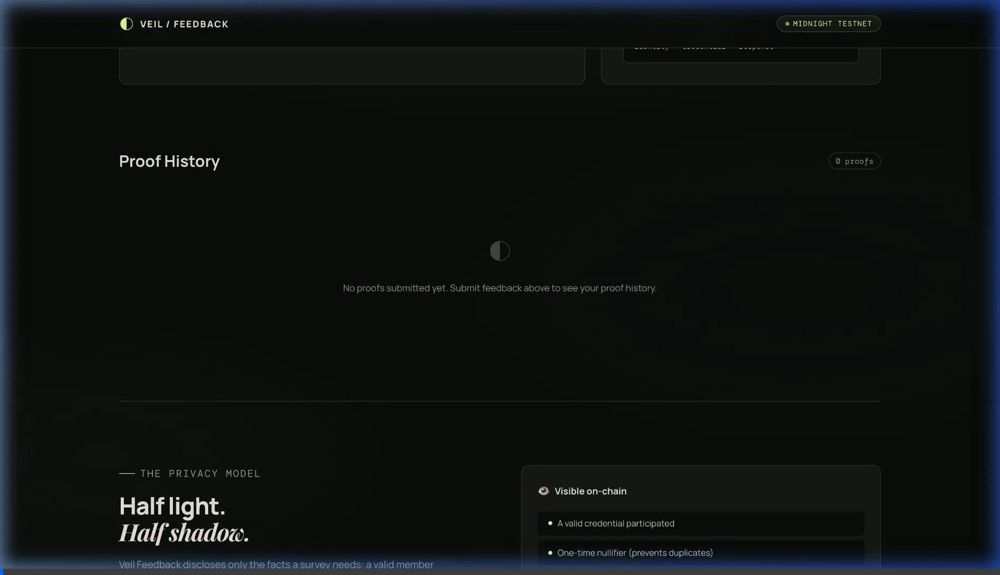

# Veil Feedback ◐

[](../../actions/workflows/ci.yml)

> Anonymous, eligibility-gated feedback with zero-knowledge proofs — your identity never appears on the public ledger.

## Live Demo

🚀 **[https://veil-three-opal.vercel.app/](https://veil-three-opal.vercel.app/)**

## Demo Video



> **Walkthrough:** 1-minute end-to-end demo showing private feedback submission, animated zero-knowledge proof derivation, on-chain aggregate tally update, and cryptographic duplicate prevention via nullifiers.

## Contract Address

| Network  | Address                          |
|----------|----------------------------------|
| Preprod  | 0x518a3fbf7cd32405e5eccbc52e612bf7bcb428ca4e29574d5209fd554ea45b8f |

## What This Does

Veil Feedback is an anonymous survey system built on Midnight's selective-disclosure model. Community members prove they're eligible and submit feedback without revealing their identity. A participant proves they are eligible and have not answered before without publicly linking their identity to a response.

**Key Features:**
- Anonymous feedback submission with zero-knowledge proofs
- One response per credential (enforced via nullifiers)
- Aggregate-only statistics published
- Privacy-preserving duplicate prevention

## Privacy Model

- **PUBLIC:** Valid proof submitted, one-time nullifier used, aggregate survey totals
- **PRIVATE:** Participant's wallet, identity, credential, individual feedback responses
- **PROVED without revealing:** Membership eligibility, no duplicate submission, valid rating range

## Privacy Claim

**What an on-chain observer sees:**
- A valid credential participated
- A one-time nullifier has not been used in this survey
- Aggregate survey totals (count, average, distribution)

**What an on-chain observer cannot see:**
- The participant's wallet, identity, or credential
- The feedback response or rating tied to a participant
- Which member produced a particular answer

## Tech Stack

- **Smart Contract:** Compact (Midnight blockchain)
- **Frontend:** Vanilla JavaScript (ES Modules)
- **Runtime:** Node.js 20+
- **Test Framework:** Node.js native test runner
- **CI/CD:** GitHub Actions
- **Deployment:** Static hosting (Netlify/Vercel/GitHub Pages)

## Prerequisites

- Node.js 20 or higher
- npm or yarn package manager
- (Optional) Midnight toolchain for contract compilation

## Setup & Run Locally

1. Clone the repository:
```bash
git clone https://github.com/KB2410/-Veil.git
cd midnight-lvl3
```

2. Install dependencies:
```bash
npm ci
```

3. Start the development server:
```bash
npm run dev
```

4. Open [http://localhost:3000](http://localhost:3000) in your browser

5. Try the demo:
   - Enter a private credential (minimum 12 characters)
   - Select a rating and provide feedback
   - Submit to see the proof generation
   - Try reusing the same credential to see duplicate prevention

## Run Tests

```bash
npm test
```

The test suite includes 4 comprehensive tests covering:
- Circuit logic (nullifier generation)
- State transitions (duplicate prevention)
- Privacy guarantees (aggregate-only output)

All tests validate the privacy-preserving protocol without requiring Midnight testnet access.

## CI/CD

The project uses GitHub Actions for continuous integration:
- **Trigger:** Runs on every `push` and `pull_request`
- **Node Version:** 22 (LTS)
- **Steps:**
  1. Checkout code
  2. Install Node.js with npm cache
  3. Install dependencies (`npm ci`)
  4. Run test suite (`npm test`)
  5. Syntax validation (`node --check src/protocol.js`)

The CI badge at the top shows real-time build status.

## Product Proposal

See [PROPOSAL.md](PROPOSAL.md) for the complete product proposal including:
- Target users and use cases
- Why Midnight specifically
- Data model and privacy guarantees
- Mainnet feasibility assessment

## Architecture

The production flow has three pieces:

1. The issuer adds credential commitments to the private Midnight state.
2. The participant's Compact circuit proves membership and creates a survey-specific nullifier. The secret credential remains client-side.
3. The contract verifies the proof, rejects a reused nullifier, and releases only an aggregate tally. Encrypted response data is readable only by its intended recipient.

```text
private credential ──local witness/proof──> Midnight contract
        │                                       │
        └─ never leaves device                  ├─ used nullifier (public)
                                                └─ aggregate tally (public)
encrypted feedback ───────────────────────────> intended recipient only
```

### Current Implementation

This repository ships a browser-executable protocol simulator so the full interaction can be tried without a testnet account. The matching Compact source is included in [`contracts/veil_feedback.compact`](contracts/veil_feedback.compact): it uses private credential witnesses, one-way membership commitments, survey-scoped nullifiers, and aggregate counters. 

Install the Midnight toolchain, compile it, and connect its generated client to replace the local adapter before deployment. The public data shape and verification rules are already isolated and tested.

## Submission Checklist

- [ ] Add your public repository URL and replace the CI badge owner
- [ ] Add the deployed live-demo URL
- [ ] Add your Preprod contract address
- [ ] Capture `npm test` output (4 passing tests)
- [ ] Record a one-minute demo: submit once, show results, then show duplicate rejection
- [ ] Fill in PROPOSAL.md with your answers
- [ ] Push at least ten meaningful commits

## License

MIT
